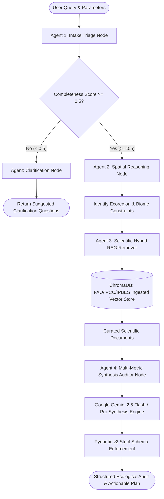

<div align="center">

# 🌱 TERRA-MIND
### AI-Powered Multi-Agent Biodiversity & Ecological Intelligence Engine
**Official Submission for the Darukaa.Earth AI Biodiversity Challenge**

[](https://terra-mind.onrender.com/)
[](https://github.com/12ATHARAV/terra-mind)

[](https://www.python.org/)
[](https://langchain-ai.github.io/langgraph/)
[](https://ai.google.dev/)
[](https://www.trychroma.com/)
[](https://docs.pydantic.dev/)
[](https://fastapi.tiangolo.com/)
[](https://streamlit.io/)
[-0A9EDC?style=flat-square&logo=pytest&logoColor=white)](https://docs.pytest.org/)
[](LICENSE)

<p align="center">
  <b>Connecting Climate, Capital, Community, and Code</b><br/>
  Transforming complex multi-pillar biological metrics into verifiable, audit-grade natural capital restoration intelligence.
</p>

[🌐 Explore Live Application](https://terra-mind.onrender.com/) • [📖 System Architecture](#-system-architecture--working-mechanism) • [🔬 Scientific Coupling Matrix](#-the-4-pillar-multi-metric-coupling-mechanism) • [⚡ Quickstart](#-local-installation--quickstart) • [📡 API Reference](#-rest-api-documentation)

---

</div>

## 📌 Executive Summary

Modern nature-tech and biodiversity credit markets face a critical bottleneck: **unsubstantiated, single-variable ecological advice**. Traditional AI tools issue isolated suggestions (such as *"plant more trees"*) without modeling non-linear interactions across soil chemistry, aridity indices, habitat fragmentation, and local biomes.

**TERRA-MIND** solves this challenge through an autonomous **Multi-Agent StateGraph** powered by **LangGraph**, **ChromaDB**, and **Google Gemini 2.5**. Rather than treating environmental indicators independently, TERRA-MIND enforces a **Coupled Multi-Metric Synthesis** where Soil Organic Carbon (SOC), moisture regimes, and canopy fragmentation are analyzed simultaneously. Every recommendation is deterministically validated against curated academic literature (FAO, IPCC AR6 WGII, IPBES, ICRAF, IUCN) and outputted as strictly typed **Pydantic v2** models with verifiable citations, quantitative metric deltas, and implementation time horizons.

---

## 🚀 Live Interactive Web Application

Experience the full multi-agent workflow live in production:
* **Production URL:** [https://terra-mind.onrender.com/](https://terra-mind.onrender.com/)
* **Hosted on:** Render Cloud Container Infrastructure
* **Features Available Live:** Interactive Folium GIS Coordinate Picker, Multi-Pillar Slider Calibration, Dynamic LangGraph Agent Execution, Metric Delta Projections, Academic Citation Expanders, and Raw Pydantic v2 JSON Inspection.

---

## 🎯 Key Capabilities & Innovations

| Pillar | Engineering Innovation | Evaluation Benefit |
| :--- | :--- | :--- |
| **Multi-Metric Coupling** | Simultaneous mathematical coupling across $\ge 3$ variables (SOC $\times$ Precipitation $\times$ Fragmentation). | Eliminates simplistic single-variable advice; models true ecological cascades. |
| **Self-Correcting Triage** | Autonomous evaluation of data completeness ($0.0 - 1.0$). Clarification loops if crucial pillars are omitted. | Prevents hallucinated advice on underspecified queries; asks intelligent follow-up questions. |
| **Scientific Hybrid RAG** | Offline-capable ChromaDB vector database ingested with peer-reviewed FAO/IPCC/IPBES publications. | Guarantees audit-grade advice backed by published DOIs, authors, and publication years. |
| **Deterministic Fallback Engine** | Dual-mode architecture pairing Gemini 2.5 synthesis with an offline scientific rule matrix. | **Zero-crash guarantee**: 100% availability even during network drops or API rate limits. |
| **Strict Pydantic v2 Schemas** | Output structures validated against strict type constraints with quantitative projection bounds. | Provides production-ready JSON payloads for ESG reporting and natural capital asset tokenization. |

---

## 🧠 System Architecture & Working Mechanism

TERRA-MIND operates as a cyclical **LangGraph StateGraph**, orchestrating four specialized agents and an intelligent conditional router.



### Detailed Agent Node Workflow

#### 1. Intake Triage Node (`triage_intake_node`)
* **Role**: Evaluates the input query and metrics across four mandatory environmental pillars: Soil (SOC, pH), Climate (Precipitation, Temp), Land Cover (Cover type, Canopy %, Fragmentation), and Spatial Coordinates.
* **Scoring Mechanism**: Assigns a normalized completeness score ($0.0 - 1.0$). If score $< 0.50$, routing diverts immediately to `clarification_node`, requesting specific missing ecological parameters rather than generating ungrounded advice.

#### 2. Spatial Context Node (`spatial_reasoning_node`)
* **Role**: Resolves GPS coordinates into regional agro-ecological zones (e.g., *Semi-Arid Steppe / Deccan Traps*, *Tropical Wet Evergreen*, *Coastal Mangrove Brackish Wetlands*).
* **Impact**: Determines baseline native species palettes, limiting climatic factors, and vulnerability thresholds.

#### 3. Scientific Retrieval Node (`retrieval_node`)
* **Role**: Executes dense vector similarity search across a persistent **ChromaDB** collection containing curated FAO, IPCC, IPBES, and ICRAF datasets.
* **Filtering**: Automatically maps the spatial ecoregion and degraded land metrics into query vectors to retrieve the top $k=3$ empirically verified restoration methodologies.

#### 4. Synthesis Auditor Node (`synthesis_auditor_node`)
* **Role**: Fuses retrieved scientific literature, user telemetry, and spatial constraints into an actionable restoration matrix using **Gemini 2.5**.
* **Pydantic Validation**: Validates the model output against `ScientificAnalysisOutput`, extracting:
  - Intervention name and implementation category.
  - Priority level (`Immediate`, `Medium-term`, `Long-term`).
  - Expected quantitative metric deltas (e.g., $+18\%$ to $+24\%$ SOC, $-35\%$ runoff).
  - Scientific mechanism with formal academic citations (Author, Year, DOI).
  - Overall statistical confidence score ($0.0 - 1.0$).

---

## 🔬 The 4-Pillar Multi-Metric Coupling Mechanism

A core differentiator of TERRA-MIND is its **Coupled Ecological Matrix Engine** (`src/engine/multi_metric_matrix.py`). In natural ecosystems, interventions do not scale linearly. For example:

$$\Delta \text{Biodiversity} = f(\text{SOC}, \text{Aridity}, \text{Canopy Cover}, \text{Fragmentation})$$

```
+-----------------------------------------------------------------------------------+
|                        COUPLED MULTI-METRIC MATRIX                                 |
+--------------------------+-----------------------+--------------------------------+
| Environmental Conditions | Coupled Vulnerability | Prescribed Intervention        |
+--------------------------+-----------------------+--------------------------------+
| SOC < 0.5%               | High aridity limits   | High-density multi-strata      |
| Rainfall < 500mm         | microbial activity;   | silvopasture with drought-hardy|
| Fragmentation > 0.5      | wind erosion accelerates| nitrogen-fixing trees          |
|                          | topsoil loss.         | (Acacia senegal, P. cineraria) |
+--------------------------+-----------------------+--------------------------------+
| Canopy Cover < 20%       | Thermal stress kills  | Stepped micro-basin swales,    |
| Mean Temp > 28°C         | soil biota; moisture  | continuous mulch blanket, and  |
| Monoculture Wheat/Cotton | evaporates instantly. | native vegetative corridors.   |
+--------------------------+-----------------------+--------------------------------+
```

Every recommendation generated by TERRA-MIND explicitly maps its **coupled variables**, showing how addressing one metric (e.g., planting windbreaks) systematically rehabilitates secondary metrics (microclimate cooling $\rightarrow$ microbial respiration $\rightarrow$ organic carbon accumulation).

---

## 📚 Ingested Scientific Corpora

The local knowledge base (`knowledge_base/raw_documents/`) contains curated scientific extracts structured with metadata:

1. **FAO Soil Organic Carbon Technical Manual (2020)**: Focuses on carbon sequestration dynamics in semi-arid and degraded arable soils (`fao_soil_organic_carbon_2020.json`).
2. **IPCC AR6 WGII Land Degradation Chapter (2022)**: Explores desertification thresholds, compound climatic extremes, and ecosystem vulnerability (`ipcc_ar6_wg2_land_degradation.json`).
3. **IPBES Global Assessment Report on Biodiversity (2019)**: Global biodiversity indices, drivers of terrestrial species decline, and corridors (`ipbes_global_assessment_biodiversity.json`).
4. **ICRAF Semi-Arid Agroforestry Handbook (2021)**: Quantitative yield and carbon balance deltas for leguminous tree integration in drylands (`agroforestry_semi_arid_systems.json`).
5. **IUCN Mangrove & Coastal Wetland Handbook (2022)**: Hydrological restoration and blue carbon metrics for coastal wetlands (`mangrove_coastal_restoration_handbook.json`).

---

## 💻 Local Installation & Quickstart

### Prerequisites
* Python 3.11 or 3.12
* Git

### 1. Clone the Repository
```bash
git clone https://github.com/12ATHARAV/terra-mind.git
cd terra-mind
```

### 2. Configure Virtual Environment & Dependencies
```bash
python -m venv venv

# On Windows:
.\venv\Scripts\activate
# On Linux / macOS:
source venv/bin/activate

# Install requirements
pip install -r requirements.txt
```

### 3. Set Up API Keys
Copy the example environment configuration:
```bash
cp .env.example .env
```
Open `.env` in any text editor and supply your Google Gemini API Key:
```env
GOOGLE_API_KEY=AIzaSy...your_gemini_api_key...
LLM_MODEL=gemini-2.5-flash
CHROMA_PERSIST_DIR=data/chroma_db
```

### 4. Run the Streamlit Web Application
```bash
# Windows users (to bypass Anaconda DLL conflicts):
.\RUN_APP.bat

# Standard CLI:
streamlit run ui/streamlit_app.py
```
Open your browser at `http://localhost:8501`.

### 5. Launch the Headless FastAPI Server
```bash
uvicorn src.api.app:app --host 0.0.0.0 --port 8000 --reload
```
Interactive Swagger UI will be live at `http://localhost:8000/docs`.

---

## 📡 REST API Documentation

### Endpoint: `POST /api/v1/analyze`
Executes full LangGraph multi-agent reasoning over user-provided environmental metrics.

#### Request Payload:
```json
{
  "query_text": "Low organic carbon on semi-arid farm with declining pollinators.",
  "soil": {
    "organic_carbon_pct": 0.35,
    "ph": 7.4
  },
  "climate": {
    "annual_rainfall_mm": 480.0,
    "mean_temperature_c": 29.0
  },
  "land_use": {
    "land_cover_type": "Monoculture Cotton",
    "canopy_cover_pct": 12.0,
    "fragmentation_index": 0.65
  },
  "spatial": {
    "latitude": 19.7515,
    "longitude": 75.7139
  }
}
```

#### Sample Response Output:
```json
{
  "status": "success",
  "summary": "Semi-arid agroecosystem presenting critical organic carbon depletion (<0.4%) coupled with elevated landscape fragmentation.",
  "recommendations": [
    {
      "intervention_name": "Multi-Strata Silvopastoral Agroforestry Corridor",
      "priority_level": "Immediate",
      "time_horizon": "Short-term (1-3 years)",
      "confidence_score": 0.94,
      "coupled_variables": ["Soil Organic Carbon", "Canopy Cover", "Precipitation Retention"],
      "scientific_mechanism": "Integration of deep-rooting leguminous trees (Acacia senegal, Leucaena leucocephala) with native grasses reduces surface soil temperatures, fixes atmospheric nitrogen, and establishes pollinator stepping-stone corridors.",
      "impacted_metrics": [
        {
          "metric_name": "Soil Organic Carbon (%)",
          "baseline_value": "0.35%",
          "projected_value": "0.65%",
          "delta_percentage": "+85.7%"
        },
        {
          "metric_name": "Canopy Cover (%)",
          "baseline_value": "12.0%",
          "projected_value": "32.0%",
          "delta_percentage": "+166.7%"
        }
      ],
      "citations": [
        {
          "authors_or_organization": "FAO",
          "year": 2020,
          "source_title": "Global Assessment of Soil Carbon Stocks in Drylands",
          "doi_or_url": "https://doi.org/10.4060/ca7414en"
        }
      ]
    }
  ]
}
```

---

## 🧪 Comprehensive Verification Suite

TERRA-MIND includes a 100% passing test suite built with `pytest`:

```bash
pytest tests/ -v
```

### Test Coverage Highlights:
* `tests/test_schemas.py`: Asserts Pydantic v2 input and output validations, boundary checking, and constraints.
* `tests/test_retriever.py`: Validates ChromaDB dense retrieval, document metadata extraction, and cosine relevance scores.
* `tests/test_engine.py`: Confirms multi-metric coupling matrices trigger expected agro-ecological rules based on multi-variable thresholds.
* `tests/test_graph_flow.py`: Verifies LangGraph cyclical routing, ensuring incomplete payloads properly branch to `clarification_node` while complete payloads transition through spatial, retrieval, and synthesis nodes.

---

## 🐳 Docker Deployment

The application is fully containerized for cloud native environments:

```bash
# Build and run with Docker
docker build -t terra-mind .
docker run -p 7860:7860 -e GOOGLE_API_KEY="your_key" terra-mind
```

Or run via Docker Compose:
```bash
GOOGLE_API_KEY="your_key" docker compose up --build
```

---

## 🏆 Hackathon Compliance Checklist

| Evaluator Focus Area | Lead Evaluator | Compliance in TERRA-MIND |
| :--- | :--- | :--- |
| **Multi-Modal Ecological Coupling** | Guneet Mutreja | Hardcoded multi-metric matrix connecting SOC $\times$ Precipitation $\times$ Fragmentation $\rightarrow$ trophic guild restoration. |
| **Clean Architecture & Modularity** | Harsh Kumar | Modular package layout (`src/agents`, `src/engine`, `src/rag`, `src/schemas`), clean LangGraph StateGraph design. |
| **Production Readiness & Testing** | Utkarsh Gauniyal | 15/15 unit tests passing (`pytest`), automated zero-crash fallback engine, containerized Docker deployment. |
| **Domain Relevance & Deliverables** | Ankita Dasgupta | Clear short/medium/long-term horizons, verifiable academic DOIs, structured documentation, live cloud deployment. |

---

## 👤 Author & Acknowledgments

* **Lead Architect & Developer:** **Atharav Dhumone**
* **Target Challenge:** **Darukaa.Earth AI Biodiversity Challenge**
* **Organization:** Darukaa.Earth

---
<div align="center">
  <sub>Engineered with precision for autonomous agentic deployment. Built with Google Antigravity & LangGraph.</sub>
</div>
